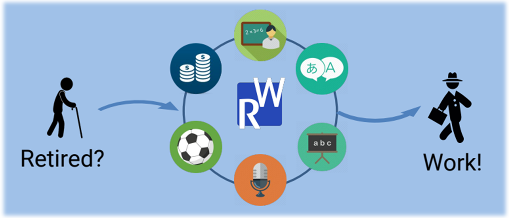
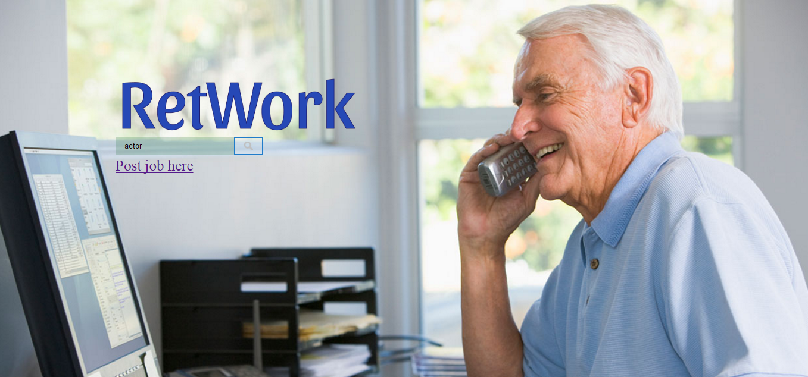
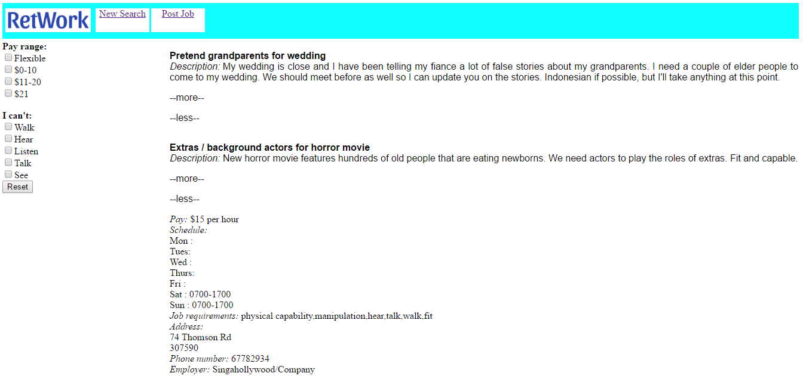

# RetWork

RetWork is a project which aims at helping ameliorate Singapore’s aging crisis with the use of information technology. The solution consists in a mobile app and a website that provide a job portal especially targeted for the elderly and/or retired citizens. Here we present the main features as well as the background of the project. OR Here we present the hypothetical features as well as the first prototype.

## Motivations

Singapore’s demographics are now in a historical turning point: the population pyramid is experiencing a fast inversion. In the upcoming years, Singapore’s people will be getting old faster than those of any other nation, with the added effect of having a slower population growth.

This poses an imminent demographic challenge to the country’s economy, which is growing into an important concern. The government is already applying a number of initiatives to ensure that their system can stay economically and socially sustainable. As a team of millennial engineers attending the GovTech Singapore Hackathon 2017, we decided to tackle this problem by developing an effective, yet accessible, technological solution: RetWork.

## Concept

A communication system connects employers and retired employees to help them become re-employed, thus contributing to themselves and to the economy of the country. These connecting services are a website and an app, both of which act as search engines for specific job offers that have been posted.

The website allows employers to post job offers into the database and includes more complex search filters. The mobile app can be used from the phone on the move and to call directly the employers. MAYBE SAY THAT BOTH OF THEM ARE REALLY ACCESSIBLE AND BLA BLA BECAUSE OF THE TECHNOLOGY GAP.

IT WOULD BE NICE TO PUT THIS LINK: https://drive.google.com/open?id=0B6MA_OmIH_L-Z3RPS3JQN3RwOTA TO THE VIDEO jajaja THOUGHTS ON THIS?

	

## Mobile App

Current features:
* Interactive and simple UI with enhanced accessibility
* Substantial amount of job offers accessed on a remote database
* Keyword search

In upcoming updates:
* Online account management
* Share interesting offers with family and friends
* Employee users will also be able to post, and not only employers

The early prototype was developed with Unity game engine and featured a list of 34 job offers. The Android version is already available for feedback on [Google Play Store](https://play.google.com/store/apps/details?id=com.SevaneGames.RetWork).

	
	

## Website

ADAPT TO THE WEBSITE PART:
Main features:
* Interactive and simple UI with enhanced accessibility
* Substantial amount of job offers accessed on a remote database
* Keyword search
* Online account management
* Share interesting offers with family and friends
* Employee users will also be able to post, and not only employers

ADAPT TO THE WEBSITE PART:
The early prototype was developed with Unity game engine and featured a list of 34 job offers.

	
	

## What comes next

Additional features that could potentially be implemented:
* Use an online database instead of a locally-stored file

EXAMPLES FROM ANOTHER PROJECT:
* Allow the user to rate recipes and suggest improvements, use machine learning to update the database based on the score given by many users
* Advanced feedback to the user using fuzzy logic
* Automatic ingredients ordering to local groceries with home delivery

## Awards

This project won the second place of the GovTech Singapore Hackathon 2017, a 3-days event focused on idea development and implementation.

## Credits

* Mobile app development: Alexis Pomares Pastor
* Website development: Andres Lulli
* Business plan and logistics: Ignacio Albert Smet
