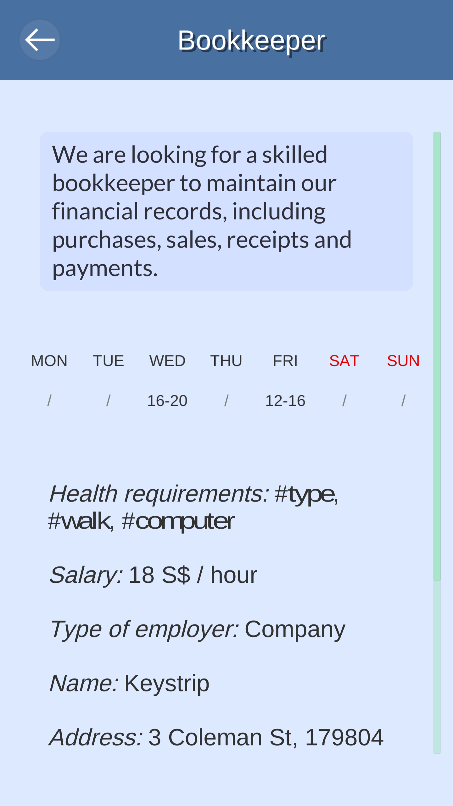

# RetWork

RetWork is a project which aims at helping ameliorate Singapore’s aging crisis with the use of information technology. The solution consists in a mobile app and a website that provide a job portal especially targeted for the elderly and/or retired citizens.

Here we present the hypothetical features as well as the first prototype.

Our mission is to provide a job portal especially targeted for the elderly and/or retired citizens, in order to make job opportunities easily accessible and offer them the chance to incorporate back to the workforce.

## Motivations

In the upcoming years, Singapore’s age average is expected to increase faster than that of any other nation. The aging population poses a serious sustainability challenge.

Cooking is healthy, culturally rewarding, and above all funny. Yet, many people don't cook and have never learnt how to, either because it is not part of their culture and they never had the opportunity to, or because they simply don't have time for it.
As a team of cooking-lover engineers attending the Singapore Nanyang Technopreneurship Center *Startathon*, we decided to tackle this problem by developing an innovative and affordable solution: Smart Chef.

## Concept

A smartphone app guides the user through several recipes, coming from different parts of the world and having diverse levels of difficulty. Step by step, the user receives feedback about his or her cooking technique in a fun and interactive way, allowing him or her to quickly be able to cook delicious food.

A small device is attached to the cooking pan or pot, and measures several parameters related to the food being cooked, such as temperature, CO2, or vibrations. This data is sent over Bluetooth to the smartphone, which analyses them, and convert them into an intuitive feedback. The device is removable and discreet, so it does not bother the user.

	

## Hardware Device

Main features:
* Three sensors measuring temperature, CO2 concentration, and acceleration
* Status LEDs
* Battery powered
* Optimized power consumption: BLE communication, low-power microcontroller, carefully selected sensors...

Early prototype:
* Arduino UNO
* Dallas DS18B20 thermocouple 
* InvenSense MPU-6050 IMU
* Bluetooth HC-05 module
* Green, Orange and Red LEDs controlled by the smartphone

## Game App

Main features:
* Various recipes (levels) accessed on a remote database
* Online account management
* Score and achievments sharing with friends
* Real-time communication with the device
* Feedback such as: "increase/decrease temperature", "give a stir" or "food is burning"

The early prototype was developed for Android with Unity game engine and featured one full recipe. It is already available for feedback on [Google Play Store](https://play.google.com/store/apps/details?id=com.SevaneGames.SmartChef).

	
	

## What comes next

Additional features that could potentially be implemented:
* Allow the user to rate recipes and suggest improvements, use machine learning to update the database based on the score given by many users
* Advanced feedback to the user using fuzzy logic
* Automatic ingredients ordering to local groceries with home delivery

## Awards

This project won the second place of the GovTech Singapore Hackathon 2017, a 3-days event focused on idea development and implementation.

## Credits

* Software development: Alexis Pomares Pastor and Timoté Vaucher
* Hardware and firmware development: Paul-Edouard Sarlin
* Prototype design: Ignacio Albert Smet
* Business plan and speech: Jacques Weniger
